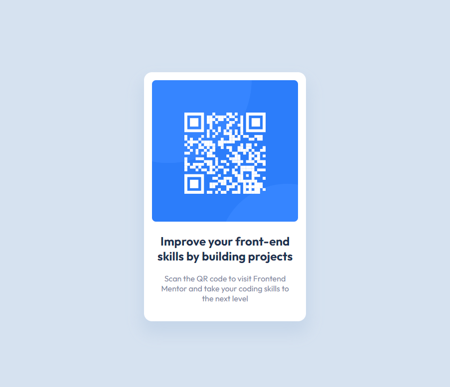

# Frontend Mentor - QR code component solution

This is a solution to the [QR code component challenge on Frontend Mentor](https://www.frontendmentor.io/challenges/qr-code-component-iux_sIO_H). Frontend Mentor challenges help you improve your coding skills by building realistic projects. 

## Table of contents

- [Overview](#overview)
  - [The challenge](#the-challenge)
  - [Screenshot](#screenshot)
  - [Links](#links)
- [My process](#my-process)
  - [Built with](#built-with)
  - [What I learned](#what-i-learned)
- [Author](#author)

**Note: Delete this note and update the table of contents based on what sections you keep.**

## Overview

### Screenshot

### Links

- Solution URL: [GitHub](https://github.com/CranJeus/qr-code-component-main)
- Live Site URL: [Netlify](https://elaborate-nasturtium-e29d26.netlify.app/)

## My process

### Built with

- Semantic HTML5 markup
- CSS custom properties
- Flex
- CSS Grid

### What I learned

I learned a bit more on matching an image closely without the use of figma. 

## Author

- Frontend Mentor - [@CranJeus](https://www.frontendmentor.io/profile/CranJeus)